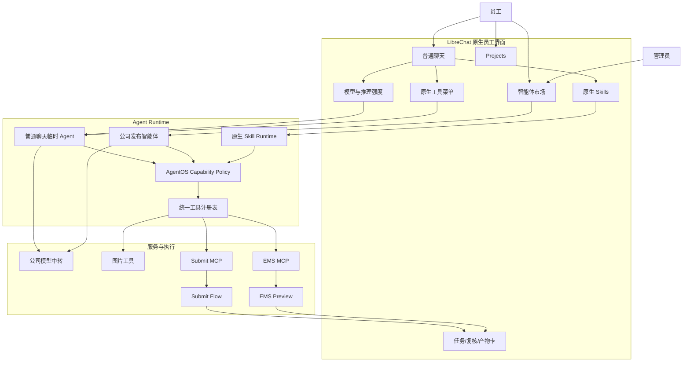

# AgentOS V0.3.1-V0.4.0 原生能力体系重构实施任务书

> 文档状态：READY FOR REVIEW  
> 决策状态：产品方向已对齐，代码实施仍需本文件评审确认  
> 适用基线：AgentOS V0.3.0 / LibreChat V0.8.7  
> 目标版本：V0.3.1、V0.3.2、V0.4.0  
> 编制日期：2026-08-27  
> 适用对象：产品负责人、架构负责人、前端、平台后端、集成开发、测试、安全及后续执行 AI

---

## 1. 文档目的

本文件用于纠正 AgentOS V0.3.0 中模型、Agent、Skill、Tool、MCP 和业务工作流混层的问题，并把后续实现拆成可以持续执行、验证和回滚的工程任务。

本文件同时是后续执行 AI 的任务边界。执行者不得仅根据局部截图进行样式修补，也不得在未满足阶段 Gate 时提前进入 Submit Flow 业务接入。

本文件不授权立即修改运行代码。代码实施必须在产品负责人评审本文件并明确回复允许实施后开始。

## 2. 已确认的产品决策

以下决策已经完成方向对齐，后续设计不得自行推翻：

1. 普通聊天保留紧凑的模型选择能力，交互参考 ChatGPT：当前档位作为单一按钮，展开后分别选择“模型”和“推理强度”。
2. 模型选择器只展示真实可用的文本模型，不展示 `Agent` 后缀模型，不展示中转端点分组，不重复展示同一模型。
3. V1 智能体由管理员创建、测试和发布；员工只使用、搜索、收藏已授权智能体，不自行公开发布智能体。
4. 通用生图接入 LibreChat 原生工具体系，不作为独立“插件”展示，也不要求员工切换到 `xxx Agent` 模型。
5. Submit Flow、EMS 等面向明确业务结果的能力进入智能体市场，由智能体组合 Skill、MCP Tool、文件、权限和结果展示。
6. Skill 只表达可复用的方法、规范、步骤和领域知识，使用 LibreChat 原生 Skills 机制。
7. Tool/MCP 是执行能力，不直接作为业务产品陈列；员工使用的是聊天、Skill 或智能体。
8. 当前底部悬浮“AI 能力 0”和自定义能力弹层从正式员工界面移除。
9. 现有服务端 Capability Gate 的安全思想保留，但应下沉为策略执行层，不再承担一套独立的用户端产品体系。

## 3. 当前问题与根因

### 3.1 模型选择器重复

当前页面同时展示：

- 5 个普通文本模型规格。
- 5 个带 `Agent` 后缀的重复模型规格。
- “立能派中转”端点下再次展示 5 个原始模型。

根因不是模型数量本身，而是把三个不同概念放进同一个选择器：

- 模型：`gpt-5.5`、`gpt-5.6-sol` 等推理资源。
- 运行方式：普通对话或 Agent Runtime。
- 服务端点：公司中转 API。

员工不应理解或选择运行端点；是否使用 Agent Runtime 也不应通过复制模型实现。

### 3.2 “AI 能力”成为第五套入口

V0.3.0 通过浏览器脚本注入“AI 能力”按钮，并独立维护插件目录、会话选择和工具注入。LibreChat 本身已经具有：

- Agent Marketplace。
- Agent Builder。
- Skills 创建、选择、手动调用和模型调用。
- 普通 Tools、MCP Tools、文件搜索、网络搜索、代码执行和 Artifacts。
- Agent、Skill、MCP 和 Marketplace 权限。

当前自定义入口与这些原生能力形成重复，导致用户无法理解“AI 能力”“Skills”“智能体市场”和模型中的 `Agent` 有何区别。

### 3.3 生图的产品层级错误

当前“AI 生图”作为会话插件出现，但其本质是两个底层工具：

- `image_gen_oai`：图片生成。
- `image_edit_oai`：图片编辑。

图片模型 `gpt-image-2` 是工具内部执行模型，不是员工普通对话所选的文本模型。将它包装为独立插件会增加不必要的选择步骤。

### 3.4 当前扩展方式不适合继续放大

当前实现通过容器启动脚本修改 LibreChat 服务端文件、修改已构建前端资源、注入额外 JavaScript，并拦截 `fetch/XMLHttpRequest`。这种方式适合原型验证，但不适合作为持续扩展的正式产品基线：

- 上游文件或构建产物变化会使文本替换失效。
- 自定义 UI 不在 React 状态、路由和权限体系内。
- 前端选择与服务端真实 Agent/Skill 状态容易出现双真相。
- 上游升级难以进行可靠的编译期检查和测试。
- 后续任务卡、复核卡和产物面板会进一步增加注入脚本复杂度。

## 4. 统一产品对象定义

后续所有需求、代码、接口、文案和测试统一使用以下对象定义。

| 对象 | 定义 | 用户是否直接选择 | 典型例子 |
|---|---|---:|---|
| Model | 底层文本推理资源 | 是，但仅在普通聊天中紧凑选择 | GPT-5.6 Sol、GPT-5.5 |
| Reasoning | 当前文本模型的推理强度 | 是，仅展示受支持档位 | 低、中、高 |
| Tool | 一次结构化执行动作 | 通过工具菜单启用，不作为业务产品 | 生图、文件搜索、运行代码 |
| MCP Server | 向 Agent 提供工具的受控服务 | 否 | Submit MCP、EMS MCP |
| Skill | 可复用的方法、规范、步骤和参考资料 | 可手动选择，也可由模型或 Agent 加载 | 月报写作规范、填报步骤 |
| Agent | 面向岗位或结果的完整智能助手 | 是，通过智能体市场选择 | 智能填报助手、EMS 数据核验助手 |
| Workflow | Agent 调用确定性后端形成的有状态业务闭环 | 不单独作为技术对象展示 | 收集文件、运行、复核、下载结果 |
| Project | 多个会话共享文件、上下文和任务主题的空间 | 是 | 月度填报项目、运营分析项目 |
| Capability Policy | 服务端最终授权和门禁 | 否 | 用户、角色、Agent、工具白名单、确认策略 |

### 4.1 禁止的混用

- 禁止在模型名称后增加 `Agent` 来表达工具能力。
- 禁止把中转端点名称展示成一级模型选项。
- 禁止把一个 Tool 直接包装成业务智能体，除非它形成了完整任务角色和工作流。
- 禁止把业务 Agent 仅实现为一段 Skill；有状态任务必须由 Agent、MCP 和业务后端共同承载。
- 禁止把前端隐藏当作权限控制。
- 禁止让模型直接提交任意路径、URL、Shell、Python、SQL 或自由命令。

## 5. 目标信息架构

```text
AgentOS
├── 新建对话
├── 搜索
├── 智能体市场
│   ├── 推荐
│   ├── 业务运营
│   ├── 数据分析
│   └── 我的收藏
├── Projects
├── 对话历史
└── 账户与设置

普通聊天输入区
├── 添加文件
├── 工具
│   ├── 文件搜索
│   ├── 网络搜索
│   ├── Skills
│   ├── 运行代码
│   ├── Artifacts
│   └── 图片生成
├── 模型与推理强度
├── 语音
└── 发送
```

### 5.1 普通聊天

普通聊天的产品名称为“智能助手”。员工可以：

- 选择允许的文本模型。
- 选择当前模型支持的推理强度。
- 临时启用工具。
- 通过 `$技能名` 或 Skills 选择器加载一个或多个 Skill。
- 上传文件并获得普通对话结果。

普通聊天不显示：

- `Agent` 后缀。
- API 端点或供应商分组。
- 图片模型名称。
- MCP Server 名称。
- 工具 Schema 名称。
- 底部悬浮“AI 能力”按钮。

### 5.2 智能体市场

智能体市场是完整业务能力的统一入口。每张卡片至少展示：

- 智能体名称。
- 一句话业务结果描述。
- 所属分类。
- 公司发布标识。
- 使用权限状态。
- 风险提示，仅在确有写操作或需要复核时展示。
- “开始使用”命令。

员工不需要看到智能体使用了哪个 MCP Server、Tool ID 或图片模型。

V1 权限策略：

- 管理员：创建、编辑、测试、发布、下架和授权。
- 员工：搜索、查看、使用和收藏已授权智能体。
- 员工默认无公开分享、编辑公司智能体和修改工具配置权限。

### 5.3 Skills

Skills 使用 LibreChat 原生能力：

- 手动选择：在输入框使用 `$` 打开 Skill 搜索，选择后以原生标签展示。
- 模型调用：允许模型根据 Skill 描述在合适场景加载。
- Agent 绑定：公司智能体只允许使用管理员配置的 Skill 白名单。
- 始终应用：仅用于公司通用、安全且低成本的基础规范。

Skill 不承担业务任务状态，不记录业务 `task_id`，不直接宣称任务完成。

### 5.4 工具

普通用户可以在原生工具菜单中启用管理员允许的通用工具。工具启用状态必须进入 LibreChat 原生会话或请求状态，不再由独立浮层保存。

工具菜单应保持扁平和克制。第一阶段目标项：

| 工具 | 普通聊天 | 业务智能体 | 备注 |
|---|---:|---:|---|
| 文件搜索 | 可选 | 按 Agent 配置 | 使用文件归属校验 |
| 网络搜索 | 可选 | 按 Agent 配置 | 受网络策略控制 |
| Skills | 可选 | 按白名单启用 | 不是执行器 |
| 运行代码 | 按角色授权 | 默认关闭 | 业务智能体不得借此绕过 Adapter |
| Artifacts | 可选 | 按 Agent 配置 | 用于可视化和文件产物 |
| 图片生成 | 可选 | 按 Agent 配置 | 内部使用 `gpt-image-2` |

## 6. 模型与推理强度设计

### 6.1 目标交互

输入框右侧或其上方保留一个紧凑按钮，按钮只显示当前推理档位，例如“高”。展开菜单：

```text
高级
├── 模型          GPT-5.6 Sol  >
└── 推理强度      高           >
```

模型子菜单第一阶段只显示产品负责人批准的模型白名单。当前对齐的首版目标为：

- `GPT-5.6 Sol`
- `GPT-5.5`

是否增加其他模型必须通过配置白名单完成，不得重新暴露端点下的全部模型。

### 6.2 展示与内部标识分离

| 用户显示 | 内部模型 ID | 说明 |
|---|---|---|
| GPT-5.6 Sol | `gpt-5.6-sol` | 高能力文本模型 |
| GPT-5.5 | `gpt-5.5` | 稳定文本模型 |

内部为了 LibreChat Runtime 所需的 Model Spec、Provider 或 Agent 配置可以存在，但不得再次作为员工可见选项。

### 6.3 推理强度合同

第一阶段展示低、中、高三个档位，实际可用值必须以公司中转 API 的真实验证结果为准：

| 用户显示 | 请求值建议 | 验证要求 |
|---|---|---|
| 低 | `low` | 中转协议接受且响应成功 |
| 中 | `medium` | 中转协议接受且响应成功 |
| 高 | `high` | 中转协议接受且响应成功 |

实施前必须完成协议探测，确认参数名称、适用协议、支持模型和流式行为。若某模型不支持推理强度：

- 不显示虚假的可选项。
- 使用该模型的服务端默认值。
- UI 明确禁用而不是静默丢弃用户选择。

### 6.4 普通聊天与业务智能体

- 普通聊天：员工可以选择模型和推理强度。
- 公司业务智能体：模型、推理强度和工具由管理员锁定，员工不切换。
- 原因：业务 Agent 的工具调用、成本、输出结构和验收结果与模型配置绑定。
- 智能体详情页可以展示“公司已配置”，不必显示技术模型 ID。

## 7. 图片生成设计

### 7.1 产品定义

“图片生成”是通用 Tool，不是独立插件。员工使用方式：

1. 在普通聊天工具菜单启用“图片生成”，或进入管理员已配置图片能力的智能体。
2. 用自然语言描述图片或上传待编辑图片。
3. 当前文本模型判断并调用 `image_gen_oai` 或 `image_edit_oai`。
4. 工具内部调用公司中转站的图片模型。
5. 生成结果回到当前会话，以图片和可下载文件展示。

### 7.2 内部配置

- 默认图片模型：`gpt-image-2`。
- 备选图片模型仅供管理员配置和故障切换。
- 图片模型不进入文本模型选择器。
- API Key、Base URL 和图片模型 ID 只保存在服务端。
- 当前中转分组未启用图片生成时，UI 应显示可理解的能力不可用信息，不把用户引导到 `xxx Agent` 模型。

### 7.3 后续独立智能体条件

只有出现以下完整工作流时，才创建“品牌设计助手”等市场智能体：

- 自动读取公司品牌规范 Skill。
- 使用固定尺寸、字体、色板和审核标准。
- 生成多个方案并支持迭代。
- 输出规定格式和命名的文件。
- 形成可验收的业务结果。

## 8. Submit Flow 和 EMS 的正确归属

### 8.1 智能填报助手

市场名称：智能填报助手。

组成：

- 固定管理员验证过的文本模型和推理强度。
- Submit Flow 业务 Skill。
- Submit MCP 白名单工具。
- 文件收集和 Attachment Broker。
- 任务状态卡。
- 人工复核卡。
- Artifact Broker 和结果文件。
- 用户、会话、Agent、任务和审计关联。

员工从市场点击“开始使用”后进入绑定该 Agent 的新会话，不需要先选择模型或再添加插件。

### 8.2 EMS 数据核验助手

市场名称：EMS 数据核验助手。

组成：

- 固定管理员验证过的文本模型和推理强度。
- EMS 只读 Skill。
- EMS MCP 只读工具。
- Profile 别名选择。
- Preview 结果卡和报告。
- 零写入门禁和审计。

该 Agent 不得获得 `test`、`execute`、`retry`、`delete`、`write` 或其他写入工具。

## 9. 目标技术架构



### 9.1 真相来源

| 数据 | 真相来源 |
|---|---|
| 可见文本模型 | 服务端模型产品目录 |
| 推理强度支持 | 中转能力矩阵 |
| 公司智能体 | LibreChat Agent 数据 + 版本化发布清单 |
| Skills | LibreChat 原生 Skill 存储或部署同步源 |
| MCP 工具 | 服务端 MCP Registry |
| 用户权限 | LibreChat Role/Permission + AgentOS Policy |
| Submit 状态 | Submit Flow `task.json`/Task Service |
| EMS 结果 | EMS Preview 产物 |
| 图片模型 | 服务端图片工具配置 |

## 10. 当前对象迁移映射

| V0.3.0 对象 | 目标处理 | 目标位置 |
|---|---|---|
| `agentos-demo` 插件 | 从员工目录删除，仅保留测试夹具 | 测试环境 |
| `agentos-image` 插件 | 取消插件卡片 | 原生工具菜单“图片生成” |
| `agentos-image.md` | 删除用户插件语义；必要说明迁入工具描述 | Tool 配置/帮助 |
| `agentos-demo.md` | 仅测试使用 | 测试夹具 |
| `agentos_plugin_ids` 前端注入 | 停止作为正式选择协议 | 原生 Agent/Skill/Tool 状态 |
| `agentos_conversation_plugins` | 冻结写入，迁移后只读保留期 | 迁移审计 |
| 自定义插件浮层 | 删除 | 原生菜单和市场 |
| `xxx Agent` Model Specs | 从员工模型目录移除 | Runtime 内部配置 |
| 原始“立能派中转”模型子菜单 | 员工端隐藏 | 服务端 Provider |
| Submit Flow 插件规划 | 改为公司发布 Agent | 智能体市场 |
| EMS 插件规划 | 改为公司发布 Agent | 智能体市场 |

## 11. 实施策略

### 11.1 源码维护决策

正式方案应维护基于 LibreChat V0.8.7 的公司源码分支并构建不可变 AgentOS 镜像，不再在容器每次启动时修改构建产物。

目标方式：

1. 锁定上游 Tag、Commit 和许可证记录。
2. 建立公司维护分支，例如 `agentos/v0.3.x`。
3. 在源码层实现 UI、状态和请求合同。
4. 运行 LibreChat 原生单元测试、E2E 和 AgentOS Gate。
5. 构建带版本和 digest 的公司镜像。
6. Compose 只运行不可变镜像和挂载部署配置。

过渡期允许保留当前 overlay 作为回滚版本，但不得继续在 `agentos-plugins.js` 中建设 Submit/EMS 任务卡。

### 11.2 配置与源码边界

优先使用配置完成：

- 可见模型白名单。
- 默认模型。
- Agent 能力开关。
- Marketplace 和 Role 权限。
- MCP Server 地址和允许地址。
- 服务端图片模型。

必须使用源码完成：

- ChatGPT 风格紧凑模型/推理菜单。
- 普通聊天与业务 Agent 的选择器差异。
- 图片工具进入原生工具菜单。
- AgentOS Policy 与原生 Agent/Skill/Tool 请求的对接。
- 任务、复核和产物卡的原生组件。

## 12. 版本实施计划

### 12.1 V0.3.1 模型与入口纠偏

目标：消除重复和错误入口，不改变 Submit/EMS 范围。

任务：

- AOS-031-01：建立员工可见模型白名单，只保留批准的真实文本模型。
- AOS-031-02：移除员工可见的 5 个 `xxx Agent` 规格。
- AOS-031-03：隐藏“立能派中转”原始端点子菜单。
- AOS-031-04：完成推理强度协议探测和能力矩阵。
- AOS-031-05：实现紧凑模型与推理强度选择器。
- AOS-031-06：业务 Agent 模式隐藏模型选择器并使用管理员锁定配置。
- AOS-031-07：移除底部“AI 能力”按钮和弹层。
- AOS-031-08：隐藏 `agentos-demo` 员工入口。
- AOS-031-09：保留旧版容器作为回滚基线。

Gate 0.3.1：

- 模型选择器不存在重复模型。
- 不显示任何 `Agent` 后缀模型。
- 不显示中转端点名称。
- 选择模型后请求使用正确内部模型 ID。
- 推理强度要么正确传递，要么按能力矩阵正确禁用。
- 页面不存在浮动“AI 能力”入口。
- 普通文本对话、流式输出和历史会话继续可用。

### 12.2 V0.3.2 原生能力体系

目标：使用 LibreChat 原生 Skills、Tools 和 Agent Marketplace 承载公司能力。

任务：

- AOS-032-01：定义公司 Agent 发布清单和版本策略。
- AOS-032-02：配置 Marketplace 员工使用权限和管理员发布权限。
- AOS-032-03：配置员工只能使用/收藏公司智能体。
- AOS-032-04：把公司 Skill 迁入 LibreChat 原生 Skill 存储或部署同步源。
- AOS-032-05：验证 `$Skill` 手动选择、标签展示和发送后状态。
- AOS-032-06：验证 Agent Skill 白名单和模型自动调用边界。
- AOS-032-07：把图片生成和编辑接入原生工具菜单。
- AOS-032-08：把现有 Capability Gate 改为原生 Agent/Skill/Tool 的服务端 Policy。
- AOS-032-09：停止正式请求中的 `agentos_plugin_ids` 前端注入。
- AOS-032-10：建立旧插件选择数据的冻结、清理和审计方案。

Gate 0.3.2：

- 员工可以打开智能体市场并使用已授权公司智能体。
- 员工不能创建、编辑或公开分享公司智能体。
- Skill 通过原生入口选择并由原生请求合同传递。
- 图片生成不需要选择 `xxx Agent` 模型。
- 未授权工具即使伪造请求也被服务端拒绝。
- 前端不存在第二套插件目录和第二套会话能力状态。

### 12.3 V0.4.0 智能填报助手

目标：以公司发布智能体完成 Submit Flow 全闭环。

任务沿用原 V0.4 合同、Adapter、文件、任务、复核和产物要求，但入口和权限模型调整为：

- Agent Marketplace 发布“智能填报助手”。
- Agent 固定模型、推理强度、Skill 和 Tool 白名单。
- Submit MCP 只能被该 Agent 和被授权角色调用。
- 用户不需要额外添加“Submit 插件”。
- 任务状态、人工复核和结果文件使用原生 React 组件展示。

Gate 0.4 除原有业务 Gate 外新增：

- 从市场进入智能填报会话后无需二次选择能力。
- 普通聊天不能调用 Submit 工具。
- 切换文本模型不能改变智能填报 Agent 的锁定模型。
- Agent 卡、会话标题、任务卡和审计中的 Agent ID 一致。

## 13. 文件级实施范围

以下是实施时必须核查的范围，不代表允许立即修改。

### 13.1 当前 AgentOS 仓库

| 路径 | 计划处理 |
|---|---|
| `deployment/librechat.yaml` | 收敛模型目录、Agent 能力和权限配置 |
| `deployment/compose.yaml` | 切换到公司构建的不可变镜像 |
| `deployment/agentos-entrypoint.sh` | 逐步移除运行时 `sed` 和构建产物注入 |
| `deployment/branding/agentos-plugins.js` | 退役，不继续增加功能 |
| `deployment/branding/agentos-theme.css` | 仅保留品牌样式，避免承担功能布局 |
| `deployment/plugins/catalog.json` | 从用户插件目录转为内部 Policy/发布清单，或被原生对象替代 |
| `deployment/agentos-runtime/catalog.js` | 移除硬编码工具集合，改为受控 Tool Registry |
| `deployment/agentos-runtime/capabilityGate.js` | 对接原生 Agent/Skill/Tool 权限合同 |
| `deployment/agentos-runtime/pluginRouter.js` | 逐步退役选择接口，保留必要审计/兼容迁移接口 |
| `deployment/overrides/OpenAIImageTools.js` | 保留中转适配，迁入公司源码分支并增加测试 |
| `scripts/Test-AgentOSV03*.ps1` | 更新模型、市场、Skill、Tool 和越权测试 |
| `docs/` | 更新 PRD、架构、版本记录和运维说明 |

### 13.2 LibreChat 公司源码分支

实施 AI 必须先定位 V0.8.7 中以下原生模块，按现有模式修改，不允许另建浮动 DOM：

- 模型选择器和 Model Spec 渲染。
- Chat 输入区 Tools Dropdown。
- SkillsCommand 和已选择 Skill 标签。
- Agent Marketplace、Agent Detail 和 Agent Builder。
- Role/Permission 与 Marketplace、Agents、Skills、MCP 权限。
- Agent 初始化、Tool Registry 和 MCP Tool 加载。
- Agent 消息、Tool Call 和 Artifact 渲染。

## 14. 服务端安全与权限要求

### 14.1 最终权限计算

一次工具调用的最终允许集合必须是以下条件的交集：

```text
角色允许工具
∩ 当前 Agent 允许工具
∩ 当前 Skill 声明工具
∩ 部署 Tool Registry
∩ 当前环境风险策略
```

客户端发送的工具列表、Agent ID、Skill 名称和角色均不能直接成为授权依据。

### 14.2 当前 V0.3 需要补齐的合同

- `confirmationPolicy` 当前只是 Manifest 字段，进入受控写操作前必须实现运行时确认。
- `mcpServerIds` 当前未形成完整运行时加载合同，V0.4 前必须接通或删除无效声明。
- 当前支持工具采用硬编码集合，必须改为可测试的注册表，但不能改成任意名称自动放行。
- 公司 Agent 发布时必须校验其 Skill、Tool、MCP、模型和角色引用全部存在。
- Agent 下架后已有会话应可查看历史，但不得继续发起新工具调用。

### 14.3 业务 Agent

- Submit 写操作必须按原 PRD 进入业务复核和确认。
- EMS V1 保持零写入。
- 图片编辑必须验证输入图片属于当前用户或当前会话。
- 文件、产物和任务下载必须验证用户、会话和业务任务归属。

## 15. 数据迁移

### 15.1 旧选择数据

`agentos_conversation_plugins` 不立即删除：

1. 发布 V0.3.2 时停止新增正式选择记录。
2. 保留至少一个回滚周期。
3. 统计是否存在仍依赖旧选择的活跃会话。
4. 历史会话只读展示不应因插件退役而失败。
5. 完成备份和回滚演练后，再单独申请删除授权。

### 15.2 Agent 发布数据

公司智能体必须具备版本化发布记录：

- `agent_id`
- 业务版本
- 显示名称和分类
- 模型和推理强度
- Skill IDs
- Tool IDs
- MCP Server IDs
- 允许角色
- 风险和确认策略
- 发布人、发布时间和验收记录

不得仅依赖管理员在页面中手工修改而没有可追溯定义。

## 16. 测试矩阵

### 16.1 模型选择

- 只有批准模型出现。
- 每个模型只出现一次。
- 无 `Agent` 后缀。
- 无中转端点菜单。
- 搜索模型不会搜出隐藏规格。
- 低、中、高映射到正确请求参数。
- 不支持推理强度的模型正确禁用选项。
- 刷新、新会话和历史会话的选择行为符合产品定义。

### 16.2 Skills

- `$` 能检索授权 Skill。
- 选择后显示原生标签。
- 发送后 Skill 正确进入该轮请求。
- 未授权 Skill 不显示，伪造调用被拒绝。
- Agent Skill 白名单生效。
- Skill 不能绕过 Agent Tool 白名单。

### 16.3 智能体市场

- 管理员可以发布和下架公司 Agent。
- 员工可以搜索、查看、收藏和开始会话。
- 员工不能修改公司 Agent。
- 无权限 Agent 不显示且直达链接被拒绝。
- Agent 固定模型和工具不被员工普通模型选择覆盖。

### 16.4 图片工具

- 普通聊天可启用图片生成。
- 不需要切换 `xxx Agent` 模型。
- 请求使用服务端图片模型。
- 生成结果在当前会话展示。
- 图片编辑校验附件归属。
- 中转无图片权限时显示明确错误。
- 文本模型选择器不出现图片模型。

### 16.5 视觉与可用性

至少验证：

- 1440 x 900 桌面视口。
- 1920 x 1080 桌面视口。
- 390 x 844 移动视口。
- 中文文本不截断、不重叠。
- 模型二级菜单不溢出视口。
- 键盘可以打开、选择和关闭菜单。
- 屏幕阅读器能识别模型、推理强度和选中状态。
- 输入框动态高度不推动浮动无关控件，因为目标界面不再存在该浮动控件。

### 16.6 回归

- 登录、退出和账号禁用。
- 普通多轮流式对话。
- 停止生成和重新生成。
- 历史会话、搜索和 Projects。
- 文件上传、下载和权限。
- Agent 工具调用和 SSE 恢复。
- MongoDB 持久化和容器重启。
- API Key 不进入浏览器、日志、报告或 Git。

## 17. 验收 Gate

### Gate A：产品结构

- 员工端只存在聊天、模型/推理、工具、Skills、智能体和 Projects 六类明确入口。
- 不存在“AI 能力”第五套概念。
- Submit/EMS 的员工入口属于智能体市场。

### Gate B：模型体验

- 模型不重复。
- 端点不暴露。
- Agent Runtime 不作为模型名暴露。
- 推理强度真实生效或明确不可用。

### Gate C：原生能力

- Skills 使用 LibreChat 原生请求和状态。
- 图片使用原生 Tool Registry 和原生会话展示。
- Agent Marketplace 使用原生 Agent 数据和权限。

### Gate D：安全

- 所有工具权限服务端重新计算。
- 普通聊天不能调用业务 Agent 专属工具。
- 员工不能篡改公司 Agent。
- 未授权 Skill、Tool、MCP 和 Agent 调用全部失败关闭。

### Gate E：工程质量

- 新功能不通过运行时 DOM 拼接实现。
- 新功能不依赖拦截全局 `fetch/XMLHttpRequest`。
- 公司镜像可复现并锁定 digest。
- 自动测试、手工验收和回滚演练均形成证据。

## 18. 发布与回滚

### 18.1 发布顺序

1. 备份 MongoDB、配置、上传文件和当前镜像 digest。
2. 在独立测试环境部署 V0.3.1。
3. 完成模型、对话和视觉 Gate。
4. 小范围切换本机验收账号。
5. 部署 V0.3.2 原生能力体系。
6. 验证历史会话和旧选择数据兼容。
7. 产品负责人确认后进入 V0.4.0。

### 18.2 回滚条件

出现以下任一情况立即回滚：

- 普通对话不可用或流式响应显著回归。
- 模型选择与真实请求模型不一致。
- 员工获得未授权 Agent、Skill 或 Tool。
- 历史会话不可访问。
- 图片或业务文件发生横向访问。
- 新镜像无法在约定时间内恢复服务。

### 18.3 回滚目标

- V0.3.1 回滚到当前 V0.3.0 锁定镜像和配置。
- V0.3.2 回滚到已经通过 Gate 的 V0.3.1。
- 回滚不删除 MongoDB 集合、上传文件或审计记录。

## 19. 后续执行 AI 的强制工作方式

执行 AI 必须按以下顺序工作：

1. 完整阅读本文件、PRD、版本化架构、V0.3 Release Record 和本机运维文档。
2. 检查 Git 状态，保护用户已有改动。
3. 只读定位 LibreChat V0.8.7 原生模型、Skills、Tools、Agents 和权限代码。
4. 先输出本次版本的文件级实施计划和风险，等待授权。
5. 一次只实施一个版本，不把 V0.3.1、V0.3.2 和 V0.4 混在同一批变更。
6. 先添加或更新测试，再进行高风险运行时迁移。
7. 每个任务完成后立即运行最小相关验证。
8. Gate 全部通过后才更新 Release Record 的完成状态。
9. 不得为了让测试通过而弱化权限、删除安全断言或伪造业务结果。
10. 遇到中转协议、账号权限、业务样例或外部服务阻塞时，明确标记 `BLOCKED`，不得猜测。

执行 AI 严禁：

- 重新创建新的浮动插件按钮。
- 继续增加 `xxx Agent` 模型规格。
- 通过 CSS 隐藏代替服务端权限。
- 在 `agentos-plugins.js` 中实现 Submit/EMS 卡片。
- 把业务状态保存在聊天消息中作为真相。
- 未经授权删除旧 MongoDB 数据。
- 修改 Submit Flow 或 EMS 核心业务逻辑。

## 20. 交付物清单

### V0.3.1

- 紧凑模型和推理强度选择器。
- 员工模型白名单配置。
- 中转推理强度能力矩阵。
- 移除浮动能力入口的实现和测试。
- V0.3.1 Release Record、截图和 Gate 报告。

### V0.3.2

- 公司 Agent 发布清单和同步方式。
- 原生 Marketplace 权限配置。
- 原生 Skills 目录和权限配置。
- 图片原生工具入口。
- AgentOS Policy 与原生 Agent/Skill/Tool 集成。
- 旧插件状态迁移和回滚记录。
- V0.3.2 Release Record、截图和 Gate 报告。

### V0.4.0

- 智能填报助手市场卡片。
- Submit Skill、MCP 合同和 Agent 配置。
- 文件、任务、复核和产物卡。
- 成功、复核、失败、越权和幂等性报告。
- V0.4.0 Release Record 和业务验收签署。

## 21. 本文件评审清单

在批准代码实施前，产品负责人需要确认：

- [ ] 模型首版白名单为 `GPT-5.6 Sol` 和 `GPT-5.5`，或提供替代清单。
- [ ] 推理强度首版目标为低、中、高，并以中转实测为准。
- [ ] 普通聊天允许选择模型，业务智能体锁定模型。
- [ ] 员工只能使用和收藏公司发布智能体。
- [ ] 通用生图进入工具菜单，图片模型不对员工展示。
- [ ] Submit Flow 和 EMS 进入智能体市场。
- [ ] 底部“AI 能力”入口删除。
- [ ] 正式实现迁入公司 LibreChat 源码分支和不可变镜像。
- [ ] V0.3.1 Gate 通过后再开始 V0.3.2。
- [ ] V0.3.2 Gate 通过后再开始 V0.4.0。

只有上述清单确认后，才可以开始 V0.3.1 代码实施。

---

## 22. 关联文档

- [项目总入口](../README.md)
- [正式产品 PRD](01_AGENT_OS_PRODUCT_PRD.md)
- [版本化架构与持续推进任务书](02_VERSIONED_ARCHITECTURE_AND_TASKBOOK.md)
- [V0.0.0-V0.5.0 周报式推进与汇报看板](03_V0.0.0_TO_V0.5.0_WEEKLY_PROGRESS_REPORT.md)
- [V0.3.0 本机运维与验收](06_V0.3.0_LOCAL_OPERATIONS.md)
- [V0.3.0 Release Record](releases/V0.3.0_RELEASE_RECORD.md)
